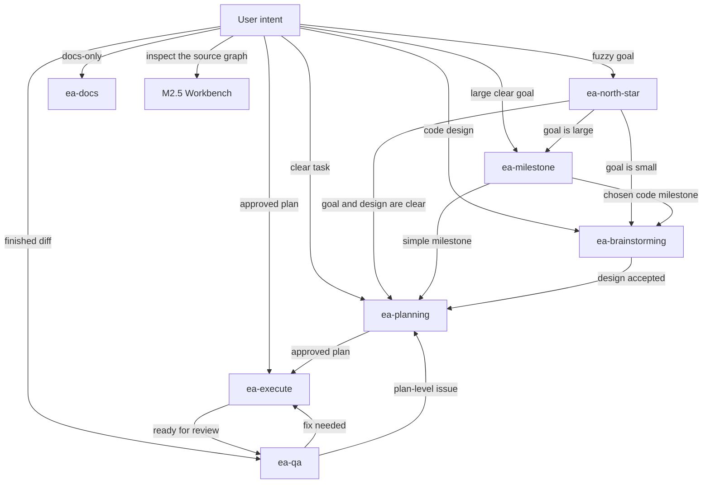

# Everything Automate Workflow Map

Everything Automate still starts with the main EA skill flow.
The Workbench is a read-only graph-first map for looking at that surface.

The workflow rule is:

```text
Use the smallest skill path that gives the current task enough boundary, evidence, and review.
```

## Flexible Entry Routes

```text
Fuzzy or drifting goal
  -> ea-north-star

Large clear goal
  -> ea-milestone

Code design choice
  -> ea-brainstorming

Clear implementation task
  -> ea-planning

Approved plan
  -> ea-execute

Finished diff
  -> ea-qa

Docs-only work
  -> ea-docs or planning-lite

Read-only analysis
  -> explorer/advisor-style answer
```

## Skill Graph



## Agent Lanes

```text
Read clarity
  -> ea-read-test

Code design brainstorming
  -> ea-senior-engineer

Planning review
  -> ea-plan-arch
  -> ea-plan-devil

Execution
  -> ea-worker
  -> ea-advisor when a hard decision appears

Final review
  -> ea-code-reviewer
  -> ea-harness-reviewer
```

## M2.5 Workbench

Run:

```bash
python3 -m src.workbench.server --host 127.0.0.1 --port 8765
```

Then open:

```text
http://127.0.0.1:8765/
```

The current Workbench is read-only.
It shows:

- a narrow icon rail
- a source and filter rail
- a graph-dominant canvas
- a right inspector
- graph controls and a minimap
- skill nodes
- agent nodes
- detected edges only

The Workbench does not show the old editing studio behavior.
There is no edit, apply, work-package, or agent-run control in the current M2.5 view.
It also does not claim live force simulation or saved layouts.

## Edge Policy

The visible graph draws detected edges only.
Plain text mentions are used to discover those edges, but they are not a separate edge kind.

## Historical Note

Older POC drafts included editing, apply, work-package, and agent-run ideas.
Those are historical notes only.
They are not current Workbench behavior.
